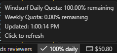

# Windsurf Quota Checker

Automatically scrapes your [Windsurf](https://windsurf.com) account for daily/weekly quota and extra balance, stores results in a local SQLite database, and shows live stats in your VS Code / Windsurf IDE status bar.

Runs silently in the background on a schedule — no browser window, no manual steps.

## Features

- Scrapes daily quota %, weekly quota %, and extra usage balance
- Persists all data in a local SQLite DB (`windsurf_quota.db`)
- Writes `quota_latest.json` for quick reads by the IDE extension
- Daily rotating log files (`logs/windsurf_quota_YYYY-MM-DD.log`, 7-day retention)
- VS Code / Windsurf IDE extension: status bar widget with click-to-sync
- Scheduled via Windows Task Scheduler — runs every 20 minutes automatically

## Project Structure

```
windsurf-quota/
├── windsurf_quota.py          # Main scraper script
├── requirements.txt           # Python dependencies
├── schedule_quota.xml         # Windows Task Scheduler import file
├── .env.example               # Credentials template
├── .env                       # Your credentials (create from .env.example)
├── .gitignore
├── logs/                      # Daily log files (auto-created)
└── vscode-extension/
    └── windsurf-quota/
        ├── extension.js       # VS Code extension
        └── package.json
```

## Requirements

- Python 3.8+
- Google Chrome installed
- Windows (for Task Scheduler automation) — the scraper itself works on any OS

## Installation

### 1. Clone and install dependencies

```bash
git clone https://github.com/BrightClick/windsurf-ide-widget.git
cd windsurf-ide-widget
pip install -r requirements.txt
```

### 2. Configure credentials

```bash
cp .env.example .env
```

Edit `.env`:
```
WINDSURF_EMAIL=your@email.com
WINDSURF_PASSWORD=yourpassword
```

### 3. Run manually (first time)

```bash
python windsurf_quota.py
```

This opens a Chrome window, logs in, scrapes quota data, and saves it to `windsurf_quota.db` and `quota_latest.json`. On subsequent runs the Chrome session is reused so login is skipped.

### 4. Schedule automatic runs (Windows)

Import the included Task Scheduler XML to run every 20 minutes silently:

```powershell
# Edit schedule_quota.xml first — update the <Command> path to your pythonw.exe
# and <Arguments> / <WorkingDirectory> to your project path, then run:
schtasks /create /xml "schedule_quota.xml" /tn "WindsurfQuotaChecker"
```

The task uses `pythonw.exe` (no console window) and `MultipleInstancesPolicy=IgnoreNew` so overlapping runs are skipped.

## VS Code / Windsurf IDE Extension

The extension shows your daily quota % in the status bar and lets you trigger a manual sync with one click.



### Install

```bash
cd vscode-extension/windsurf-quota
# Install via VS Code CLI:
code --install-extension .
```

Or open the folder in VS Code and press `F5` to run in development mode.

### Configure (Settings)

| Setting | Description | Example |
|---|---|---|
| `windsurfQuota.jsonPath` | Path to `quota_latest.json` | `C:\Projects\windsurf-quota\quota_latest.json` |
| `windsurfQuota.scriptPath` | Path to `windsurf_quota.py` | `C:\Projects\windsurf-quota\windsurf_quota.py` |
| `windsurfQuota.pythonPath` | Python executable | `python`, `python3`, or full path to `pythonw.exe` |
| `windsurfQuota.refreshIntervalSeconds` | How often to re-read the JSON (seconds) | `60` |

### Usage

- **Status bar** shows live daily quota % with a color indicator (green / yellow / red)
- **Click** the status bar item to trigger an immediate sync (runs `windsurf_quota.py`)
- The display auto-updates whenever `quota_latest.json` changes on disk

## Logs

Logs are written to `logs/windsurf_quota_YYYY-MM-DD.log`, one file per day, kept for 7 days.

## Troubleshooting

- **Login fails** — verify credentials in `.env`; check `error_screenshot.png` saved next to the script
- **No data in status bar** — ensure `windsurfQuota.jsonPath` points to `quota_latest.json` and the script has run at least once
- **ChromeDriver mismatch** — `undetected-chromedriver` auto-matches Chrome version; update Chrome if issues persist
- **Task not running** — check Task Scheduler history; re-import `schedule_quota.xml` if needed

## Security

- Credentials are stored only in `.env` (excluded from git)
- Chrome profile is stored locally in `chrome_profile/` (excluded from git)
- No data is sent anywhere — everything stays local

## License

MIT
